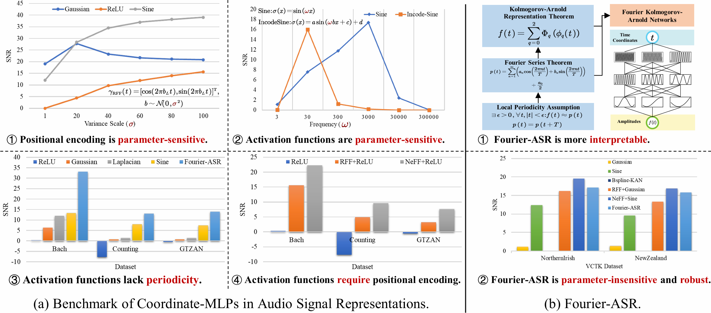
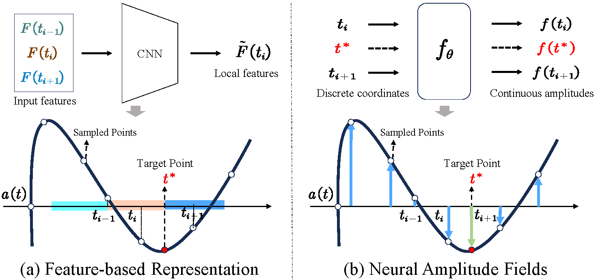
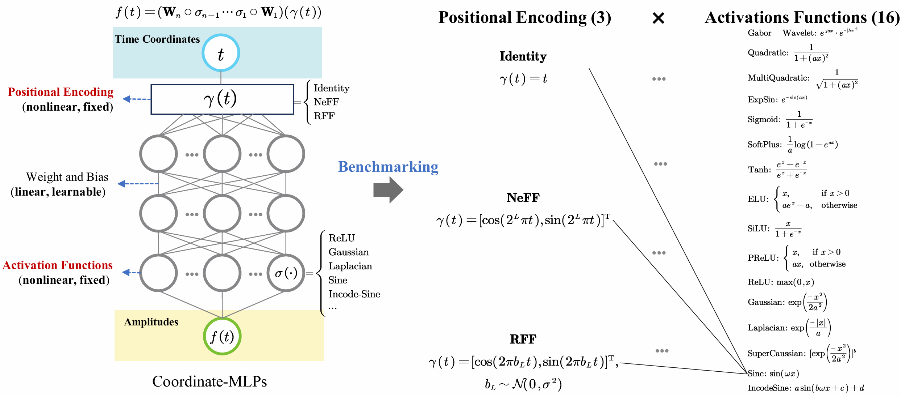
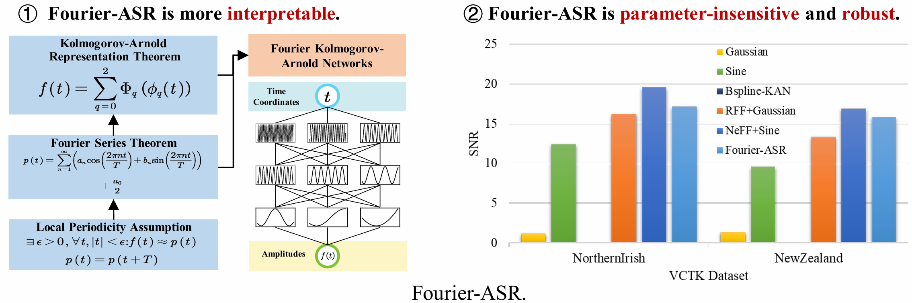

<p align="center">
  <h1 align="center">
    Representing Sounds as Neural Amplitude Fields:
    <br>
    A Benchmark of Coordinate-MLPs and A Fourier Kolmogorov-Arnold Framework
  </h1>
</p>

<p align="center">
  <a href="">
    
  </a>
</p>

## What is Neural Amplitude Fields?
<p align="center">
  <a href="">
    
  </a>
</p>

## Environment Configuration
- Configure a Python environment and install related dependencies.
  ```
  pip install -r requirements.txt
  ```

- Download the required dataset from the following websites.
  - CSTR VCTK: https://datashare.ed.ac.uk/handle/10283/3443
  - GTZAN: https://huggingface.co/datasets/marsyas/gtzan
  - Bach: https://github.com/vsitzmann/siren/blob/master/data/gt_bach.wav
  - Counting: https://github.com/vsitzmann/siren/blob/master/data/gt_counting.wav
- Organize the data set according to the following file structure.
  ```
  --data
    --demo
      --gt_bach.wav
      --gt_counting.wav
      --gt_blues00000.wav  # from GTZAN dataset blues_00000.wav
    --gtzan
      --genres
        --blues
        ...
    --VCTK
      --wav48_silence_trimmed
        --p231
        ...
  ```

## Benchmark of Coordinate-MLPs in Audio Signal Representations
### Overview
<p align="center">
  <a href="">
    
  </a>
</p>

### Run
- Testing on ``Bach``, ``Counting``, and ``Blues``.
```
bash scripts/benchmark_MLPs_demo.sh
```

- Testing on ``CSTR VCTK`` dataset.
```
bash scripts/benchmark_MLPs_vctk.sh
```

- Testing on ``GTZAN`` dataset.
```
bash scripts/benchmark_MLPs_gtzan.sh
```

## Fourier-ASR: A Fourier Kolmogorov-Arnold Framework
### Overview
<p align="center">
  <a href="">
    
  </a>
</p>

### Run
- Testing on ``Bach``, ``Counting``, and ``Blues``.
```
bash scripts/benchmark_KANs_demo.sh
```

- Testing on ``CSTR VCTK`` dataset.
```
bash scripts/benchmark_KANs_vctk.sh
```

- Testing on ``GTZAN`` dataset.
```
bash scripts/benchmark_KANs_gtzan.sh
```

## Ablation Experiments
### Positional encoding is parameter-sensitive
- ``RFF`` positional encoding is sensitive to the dimension parameter $L$.
```
bash scripts/benchmark_FFN_L.sh
```

- ``RFF`` positional encoding is sensitive to the variance parameter $\sigma$.
```
bash scripts/benchmark_FFN_sigma.sh
```

- ``NeFF`` positional encoding is sensitive to the dimension parameter $L$.
```
bash scripts/benchmark_NeRF_L.sh
```

### Activation functions are parameter-sensitive
- ``Gaussian-type`` activation functions are sensitive to the variance factor $a$.
```
bash scripts/benchmark_gaussian.sh
```

- ``Sine-type`` activation functions are sensitive to the frequency factor $\omega$.
```
# Sine
bash scripts/benchmark_siren.sh

# Incode-Sine
bash scripts/benchmark_incode-sine.sh
```

### Periodic activation functions are sensitive to initialization schemes
```
bash scripts/benchmark_sensitive_init.sh
```
